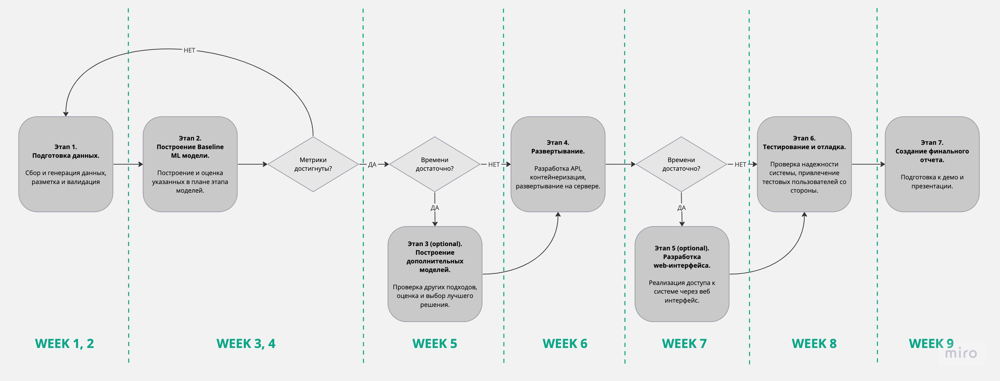

# ML System Design Doc - [RU]
## Дизайн ML системы - RaisonText MVP

### 1. Цели и предпосылки
#### 1.1. Зачем идем в разработку продукта?

*Disclaimer: мы находимся не в контексте компании, где требуется ml design doc для внутреннего проекта, и сами выступаем в роли бизнес-заказчика.*

Бизнес-цель: разработать систему для оценки текстовых документов по содержательности (качеству контента, связности, смысловой нагрузке), чтобы использовать в работе в НЛП-задачах, и получить удовольствие от создания интересного пет-проекта.

Критерий успеха:

- решение работает, доступно по API
- на входе - текст
- на выходе - численная оценка
- стало удобнее оценивать тексты
- ROC/AUC > 75%. *TODO:* уточнить выбор метрики

#### 1.2. Бизнес-требования и ограничения  

Требования:

- код решения и данные в открытом доступе, open source
- код и документация находится в этом репо
- используются только публично доступные или сгенерированные данные
- система обрабатывает документы на английском языке
- система обрабатывает документы размером от 50 до 1000 токенов
- система может принимать от 1 до 100 документов за 1 запрос
- система имеет простой web UI с возможностью вставить 1 документ и получить оценку
- на выходе система отдает скор от 0 до 1 на каждый входной документ
- время ответа не более 15 сек

Возможные применения и пути развития проекта:

- использование дата сайнтистами в рабочих задачах: очистке/фильтрации данных, оценке синтетических данных
- использование для поиска/ранжирования текстового материала
- интеграция в сервисы, которые работают с сообщениями/постами, веб-страницами, научными статьями и т.п. для аналогичных целей

### 2. Методология

#### 2.1. Постановка задачи

Решаем задачу классификации текстовых документов на семантически качественные и не качественные, обязательно интерпритируем предсказанную вероятность.

#### 2.2. Блок-схема решения

   

#### 2.3. Этапы решения задачи

**Этап 1. Подготовка данных**

Задачи:
- собрать датасет текстов разного качества
- сгененировать необходимое количество примеров *TODO:* на этапе EDA добавить технических подходов к генерации
- разметить данные *TODO:* на этапе EDA добавить технических подходов к разметке

Риски и вызовы:
- сделать качественную разметку
- формализовать метрику оценки

Выход:
- не менее 5 млн текстовых документов размеченных скором от 0 до 1
- баланс классов (если делить по 0.5 порогу) не хуже чем 4:1
- оценка распределений, качества и характера данных
- *TODO:* добавить требования по хранению и версионированию данных

**Этап 2. Построение Baseline ML модели**

Задачи:
- реализовать обработку, чистку, представление текстовых данных
- feature engineering
- применить простую эвристику с использованием вероятностей
- применить лог рег (и может быть сравнить с деревянными моделями)
- *TODO:* возможно добавить тех. требования по проведению экспериментов

Риски и вызовы:
- выгореть и быть не в ресурсе

Выход:
- стабильный пайплайн на python с четкими шагами
- покрытие кода тестами не менее 50%
- пакет в pypi
- модель и параметры сохранить
- достигнуть указанного в п 1.1 значения метрики
- оценка вычислительной сложности и интерпретация моделей
- дополннения к ограничениям следующих этапов, если есть

**Этап 3 (optional). Построение дополнительных моделей**

Задачи:
- реализация и оценка других подходов помимо базовых *TODO:* уточнить задачи - промпт для ChatGPT, тюнинг таких-то открытых ллм
- сохранение проведенных экспериментов
- выбор оптимального решения, ансамблирование

Риски и вызовы:
- доступные мощности и время на эксперименты

Выход:
- документация по проведенным экспериментам
- код по отвергнутым гипотезам допустимо оставить в jupyter тетрадках
- реализация оптимального варианта

**Этап 4. Развертывание**

Задачи:
- разработка API
- развертывание системы на сервере
- отладка мониторинга и логгирования
- *TODO:* добавить требования к инфраструктуре

Риски и вызовы:
- проблемы с соблюдением ограничений из п. 1.2

Выход:
- доступный к использованию API
- соответствующая документация
- примеры использования в readme

**Этап 5 (optional). Разработка web интерфейса**

Задачи:
- создание страницы с простым интерфейсом
- возможность вставить текст документа
- возможность получить оценку документа
- обработка ошибок и нестандартных юз-кейсов
- *TODO:* добавить технический стек

Риски и вызовы:
- отсутствуют, т. к. этап optional и может быть не реализован

Выход:
- соответствующая кодовая база, возможно в другом репо
- работающая web-страница с заявленным функционалом

**Этап 6. Тестирование и отладка**

Задачи:
- устранение технического долга
- тестирование системы
- привлечение пользователей со стороны для пробного использования системы
- отработка сценариев отказа и повреждения системы

Риски и вызовы:
- ненадежность системы, сбои в работе
- уязвимости системы

Выход:
- необходимые исправления и доработки

**Этап 7. Создание финального отчета**

Задачи:
- подготовить защиту проекта

Риски и вызовы:
- отсутствуют, т. к. линейная работа с предсказуемым результатом

Выход:
- план презентации
- необходимые материалы к демо
- если этап 5 не успешен - небольшой google colab для демо
