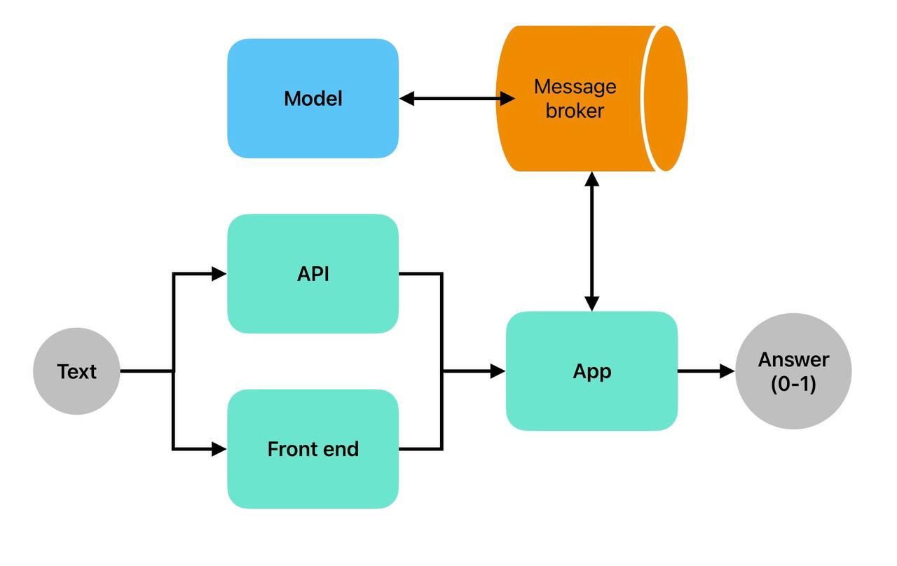
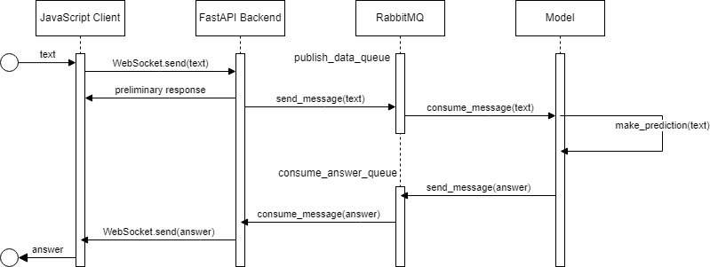

# ML System Design Doc - [RU]
## Дизайн ML системы - RaisonText MVP

### 1. Цели и предпосылки
#### 1.1. Зачем идем в разработку продукта?

- Бизнес-цель:
  - разработка инновационной онлайн системы распознавания синтетически сгенерированного текста для обеспечения высокой точности в выявлении неоригинальных конструкций. Наша миссия заключается в предоставлении эффективного решения для компаний и организаций, сталкивающихся с риском мошенничества, распространения фейковой информации или других негативных последствий, связанных с использованием синтетического текста.

- Чему помогаем:
  - Наш продукт призван снизить риски и затраты, связанные с воздействием синтетического контента, обеспечивая клиентам возможность быстрого и надежного выявления поддельных текстовых данных. Наш подход направлен на создание эффективного инструмента, который может использоваться в реальном времени для мониторинга и фильтрации текстов, повышая уровень безопасности и достоверности информации в онлайн-среде.

- Что считаем успехом:
    - решение доступно всем по API или через сайт
    - решение отказоустойчиво и не падает при большой нагрузке
    - решение имеет понятную документацию по внедрению

- Расходы:
  - Работа дата-саентистов: Включает в себя оплату труда и прочие издержки, связанные с формированием и поддержанием команды дата-саентистов, занимающихся созданием и поддержкой ML-моделей для системы противодействия мошенничеству.
  - Инфраструктурные затраты на ML-модели: Включают расходы, связанные с необходимой инфраструктурой для развертывания и функционирования ML-моделей. Это может охватывать расходы на вычислительные ресурсы (например, серверы или облачные вычисления), хранение данных, сетевую инфраструктуру, обеспечение безопасности и т.д. 

#### 1.2. Бизнес-требования и ограничения  

- Бизнес-требования:

    - код решения и данные в открытом доступе, open source
    - используются только публично доступные или сгенерированные данные
    - система обрабатывает документы на английском и русском языках

- Бизнес-ограничения:

    - система обрабатывает документы размером от 50 до 1000 токенов
    - система может принимать 1 документ за 1 запрос
    - система имеет простой Web UI с возможностью вставить 1 текстовый документ и получить оценку
    - на выходе система отдает числовое значение от 0 до 1 на каждый входной документ
    - время ответа не более 10 секунд

- Возможные пути развития проекта:

  - дообучение существующих моделей, и тюнинг гиперпараметров
  - проверка новых моделей (GPT-like, BERT и другие)
  - расширение обучающего набора данных, обогащение более качественными примерами
  - масштабирование проекта на другие языки и на новые платформы (телеграм и тд)
  - добавление мониторинга модели и данных

- Возможные применения проекта:

  - фильтрация постов/комментариев/ответов в онлайн сервисах и сообществах
  - фильтрация статей и научных достижений (research integrity)
  - проверка оригинальности текстовой работы (эссе, курсовая и тд) в образовании

#### 1.3 Типичный сценарий использования

- Научный журнал $Name$, который дорожит своей репутацией и читателями, интегрировал наш сервис по API. Теперь перед добавлением новой статьи для своих платных подписчиков, система проводит качественную оценку материала статьи на оригинальность с помощью нашего сервиса

### 2. Методология

#### 2.1. Постановка задачи

Задача бинарной классификации текстовых документов

#### 2.2 Критерии успеха технического решения

Ответ сервера не более 10 секунд и качество ML модели на основе метрики ROC-AUC > 75%

Вот как вычислить ROC-AUC:

- Получаем значения TPR и FPR:

   - TPR (True Positive Rate) - это доля истинно положительных случаев, которые модель правильно классифицировала.
   - FPR (False Positive Rate) - это доля ложноположительных случаев, которые модель ошибочно классифицировала как положительные.

- Строим ROC-кривую:

   - Отсортируем предсказанные значения вероятности от наивысшего к наименьшему. Начнем с TPR = FPR = 0.
   - Для каждого порога классификации:
     - Если объект классифицируется как положительный, увеличим TPR.
     - Если объект классифицируется как отрицательный, увеличим FPR.
   - Нарисуем точки на графике, соединяя их линиями.
- Вычислим AUC:

   - После построения ROC-кривой, вычислим площадь под ней. Это можно сделать различными методами, такими как метод трапеции или интегрирование.
- Интерпретация AUC:
  - AUC лежит в диапазоне от 0 до 1. Чем ближе к 1, тем лучше модель различает классы. Значение 0.5 означает случайное угадывание.

#### 2.3. Диаграмма архитектуры решения задачи

   

#### 2.4. Этапы решения задачи

**Этап 1. Подготовка данных**

Задачи:
- собрать датасет текстов
- сгененировать необходимое количество примеров (хотя бы 1000)
- разметить данные

Риски и вызовы:
- сделать качественную разметку
- создать необходимый уровень разнообразия данных, чтобы не переобучаться на тематику текстов или способ их генерации

Выход:
- не менее 1000 текстовых документов
- баланс классов (если делить по 0.5 порогу) не хуже чем 4:1
- оценка распределений, качества и характера данных

**Этап 2. Построение Baseline ML модели**

Задачи:
- реализовать обработку, чистку, представление текстовых данных
- применить tf-idf + log reg как базовый подход
- feature engineering

Риски и вызовы:
- выгореть и быть не в ресурсе

Выход:
- стабильный пайплайн на python
- покрытие кода тестами не менее 50%
- сохраненная модель
- достигнуть указанного в п 1.1 значения метрики
- оценка вычислительной сложности и интерпретация моделей

**Этап 3 (optional). Построение дополнительных моделей**

Задачи:
- реализация и оценка других подходов помимо базовых
- сохранение проведенных экспериментов
- выбор оптимального решения, ансамблирование

Риски и вызовы:
- доступные мощности и время на эксперименты

Выход:
- документация по проведенным экспериментам
- код по отвергнутым гипотезам допустимо оставить в jupyter тетрадках
- реализация оптимального варианта

**Этап 4. Развертывание**

Задачи:
- разработка API
- развертывание системы на сервере
- отладка мониторинга и логгирования

Риски и вызовы:
- проблемы с соблюдением ограничений из п. 1.2

Выход:
- доступный к использованию API
- соответствующая документация
- примеры использования в readme

**Этап 5 (optional). Разработка web интерфейса**

Задачи:
- создание страницы с простым интерфейсом
- возможность вставить текст документа
- возможность получить оценку документа
- обработка ошибок и нестандартных юз-кейсов

Риски и вызовы:
- отсутствуют, т. к. этап optional и может быть не реализован

Выход:
- соответствующая кодовая база, возможно в другом репо
- работающая web-страница с заявленным функционалом

**Этап 6. Тестирование и отладка**

Задачи:
- устранение технического долга
- тестирование системы
- привлечение пользователей со стороны для пробного использования системы
- отработка сценариев отказа и повреждения системы

Риски и вызовы:
- ненадежность системы, сбои в работе
- уязвимости системы

Выход:
- необходимые исправления и доработки

**Этап 7. Создание финального отчета**

Задачи:
- подготовить защиту проекта

Риски и вызовы:
- отсутствуют, т. к. линейная работа с предсказуемым результатом

Выход:
- план презентации
- необходимые материалы к демо
- если этап 5 не успешен - небольшой google colab для демо

#### 2.5. Данные для задачи

Мы собрали и сгенерировали 941 тысячу примеров написанных человеком (33%) и сгенерированных ИИ (67%) текстов.

Использовали также публичные датасеты:

- [GPT-wiki-intro](https://huggingface.co/datasets/aadityaubhat/GPT-wiki-intro)
- [DeepfakeTextDetect](https://github.com/yafuly/DeepfakeTextDetect)
- [TuringBench](https://huggingface.co/datasets/turingbench/TuringBench/tree/main)

Использовали модели:

- Chat-GPT
- opt-125m
- opt-1.3b
- opt-2.7b
- llama2-7b
- llama2-13b

Имя модели указано в отдельной колонке

Датасет может быт скачан [здесь](https://drive.google.com/file/d/1PQxFbcEoH7Md7SM5d8fJv1k1B3sfbG-j/view?usp=sharing).

Какая-то часть сгенерированных данных находится в [HuggingFace](https://huggingface.co/datasets/yatsy/GPT-wiki-intro-extension).

### 3. Внедрение
#### 3.1. Архитектура решения

#### 3.2. Описание инфраструктуры и масштабируемости

- Основная серверная часть реализована с помощью фреймворка FastAPI. FastAPI позволяет загружать файлы асинхронно, что полезно при работе с большими объемами данных. FastAPI следует принципам и стандартам OpenAPI, JSON Schema, OAuth, и другим, что упрощает интеграцию с другими системами и обеспечивает совместимость с широким спектром инструментов.
- Фронтенд приложения написан с использованием JavaScript и вебсокета. Веб-сокеты хорошо масштабируются при обработке множества одновременных подключений. Асинхронные возможности языков программирования, таких как JavaScript (в частности, с использованием асинхронных функций и обещаний), позволяют эффективно управлять многозадачностью и обеспечивать отзывчивость приложения.
- Модель является независимой единицей, которая может быть запущена на удаленном сервере, либо прямо на сервере заказчика.
- Общение сервера с моделью происходит посредством брокера сообщений RabbitMQ. RabbitMQ позволяет организовать асинхронное взаимодействие между компонентами приложения. Это особенно полезно в сценариях с машинным обучением, где часто требуется асинхронное выполнение задач, например, обучение моделей, обработка данных, и так далее. Асинхронность помогает улучшить производительность и отзывчивость приложения.

Запуск приложения подробно рассмотрен в README.md на главной странице репозитория, в пункте How to run

#### 3.3. Технические требования

**Минимальный состав аппаратных средств**

Технические средства должны включать в себя следующие программные и аппаратные составляющие:

- персональный компьютер с операционной системой Ubuntu 20:04 и выше
- процессор с частотой не менее 3 ГГц
- GPU видеокарту серии NVIDIA GTX 1080Ti и выше
- наличие устройств ввода
- оперативную память не менее 8Гб
- жесткий диск объемом 40 Гб и выше

**Минимальный состав программных средств**

Для функционирования программы необходимы следующие программные средства:

- python версии 3.8 или выше и установленные зависимости;
- набор инструментов CUDA для Linux версии 11.3 или выше.

#### 3.4. Требования к работе системы
Пропускная способность и задержка обеспечивается структурой и возможностью масштабирования

#### 3.5. Безопасность системы
Обеспечивается отсутствием внешних связей

#### 3.6. Безопасность данных
Безопасность данных обеспечивается 100%, так как данные не хранятся и не используются дополнительно

